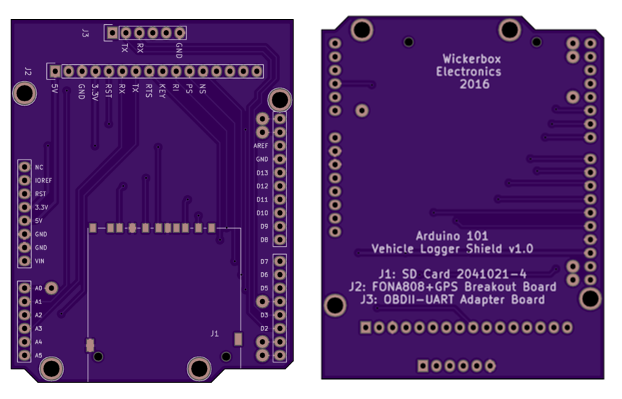

# Pothole Project
## Hardware v1.0 

This is a simple breakout board to attach an OBDII-UART adapter board, Fona 808 2G + GPS breakout board, and an SD card to the Arduino 101. 

### Bill of Materials

|Part|Source|Link|
|----|------|----|
|Arduino 101|Adafruit|<a href="https://www.adafruit.com/products/3033">$39.95</a>|
|Fona 808 2G + GPS Breakout Board|Adafruit|<a href="https://www.adafruit.com/products/2542">$49.95</a>|
|OBDII-UART Adapter Board|Sparkfun|<a href="https://www.sparkfun.com/products/9555">$49.95</a>
|SD Card holder|Digikey|<a href="http://www.digikey.com/product-search/en?keywords=A101492CT-ND">$3.10</a>|
|1x06 0.1" pitch female header|Digikey|<a href="http://www.digikey.com/product-search/en?keywords=952-1808-ND">$0.97</a>|
|1x16 0.1" pitch female header|Digikey|<a href="http://www.digikey.com/product-detail/en/sullins-connector-solutions/PPPC161LFBN-RC/S7049-ND/810188">$1.27</a>|

The printed board is a 2 layer board of 2.71x2.11 inches (69x53mm). $28.45 for three. 
