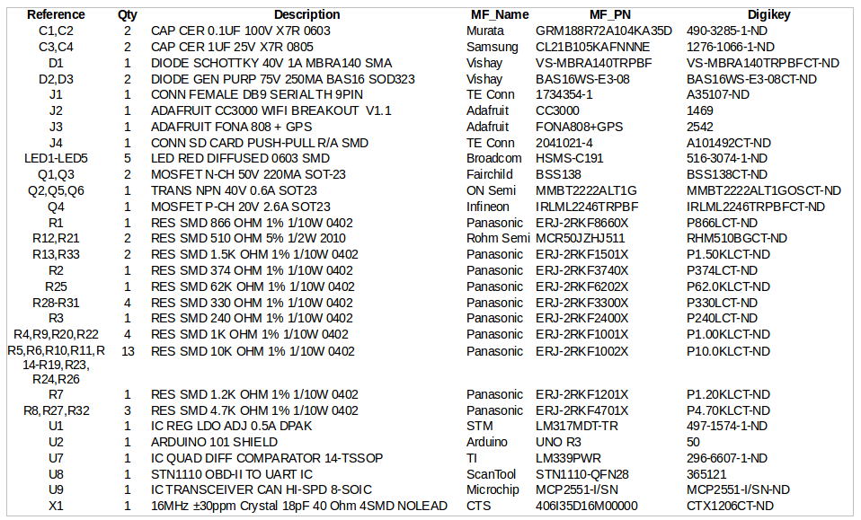

# Pothole Project
## Vehicle Datalogger Shield v1.0 

This shield is heavily based on the OBDII-UART adapter board from Sparkfun and ScanTool, but it adds headers for the Fona 808 2G + GPS breakout board and CC3000 Wifi breakout board, and provides an onboard miniSD holder for datalogging.  

### Bill of Materials

